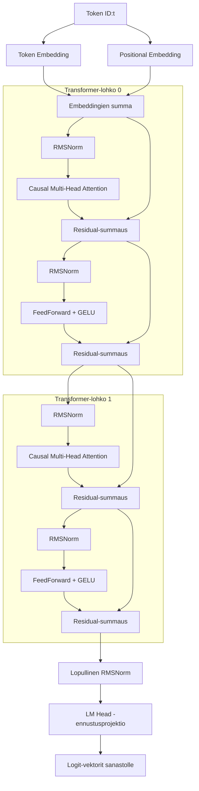

# Lumi LLM - Kielimallin Logiikka, Rakenne ja Säännöt

Tämä dokumentti kuvailee Lumi LLM -kielimallin ja sen visualisointisovelluksen taustalla toimivan matemaattisen ja semanttisen logiikan. Dokumentti on jaettu neljään pääosaan:
1. **Konfiguraatio (`config.json`)**
2. **Sanasto ja Tokenizer (`vocab.txt` & `tokenizer.py`)**
3. **Koulutusaineisto ja Semanttiset Säännöt (`dataset.txt` & `dataset.py`)**
4. **Malliarkkitehtuuri ja Laskentavirta (`model.py`)**

---

## 1. Konfiguraatio (`config.json`)

Malli ja sen suoritusympäristö ladataan ja alustetaan keskitetysti yhden tiedoston kautta. Tiedosto sisältää seuraavat parametrit:

*   `d_model` (oletus: `32`): Piilevän tilan (hidden state) tai embedding-vektorin pituus. Jokainen sana ja välimuuttuja esitetään näin monen reaaliluvun vektorina.
*   `n_heads` (oletus: `2`): Attention-päiden lukumäärä. Kukin pää oppii tarkastelemaan sanojen välisiä suhteita eri näkökulmista.
*   `d_ff` (oletus: `64`): Transformer-lohkon sisäisen lisäverkon (FeedForward) välikerroksen koko.
*   `n_layers` (oletus: `2`): Transformer-kerrosten lukumäärä.
*   `max_seq_len` (oletus: `20`): Konteksti-ikkunan eli pisimmän mallille sallitun syötepituuden maksimi tokeneissa.
*   `dropout` (oletus: `0.1`): Dropout-säännöllistämisen suhde ylisovituksen ehkäisemiseksi.
*   `vocab_path`: Polku sanastotiedostoon.
*   `dataset_path`: Polku koulutusaineistotiedostoon.

---

## 2. Sanasto ja Tokenizer (`vocab.txt` & `tokenizer.py`)

Kielimalli ei ymmärrä suoraan tekstiä, joten se täytyy muuttaa numeroiksi (ID-tunnisteiksi).

### Sanastotiedosto (`vocab.txt`)
Sanasto ladataan riveittäin tiedostosta. Oletussanasto koostuu 14 tokenista:
1.  `<pad>`: Täyte-token, jolla lyhyemmät lauseet venytetään vakiomittaiseksi.
2.  `<bos>`: Lauseen aloitusmerkki (Beginning of Sentence).
3.  `<eos>`: Lauseen lopetusmerkki (End of Sentence).
4.  `kissa`, `koira`, `hiiri`, `kala`, `juusto`: Substantiivit.
5.  `katsoo`, `jahtaa`, `syö`, `nukkuu`: Verbit.
6.  `ja`, `hyvin`: Rinnastuskonjunktio ja adverbi.

### Tokenizer-logiikka
*   **Koodaus (`encode`)**: Teksti jaetaan välilyöntien perusteella sanoiksi. Jokainen sana mapataan sanaston mukaiseen indeksiin (`word2id`). Jos sanaa ei löydy sanastosta, se ohitetaan.
*   **Purku (`decode`)**: Lista ID-indeksejä muutetaan takaisin sanoiksi käyttämällä käänteistä mappia (`id2word`).

---

## 3. Koulutusaineisto ja Semanttiset Säännöt (`dataset.txt` & `dataset.py`)

Mallille luodaan synteettinen koulutusaineisto (1000 riviä), jotta sille saadaan opetettua tiukat kieliopilliset ja semanttiset säännöt.

### Semanttiset suhteet (Säännöt)
Aineiston generoinnissa ja sovelluksen suorittamassa eräajo-validoinnissa seurataan seuraavia sääntöjä:

1.  **Toimijat ja verbit**:
    *   `kissa` ja `koira` voivat tehdä mitä tahansa seuraavista: `syö`, `katsoo`, `jahtaa`.
    *   `hiiri` voi ainoastaan `syö` tai `katsoo`. Se ei voi jahdata ketään (`jahtaa` ei ole sallittu).
2.  **Syöminen (`syö`)**:
    *   Jos tekijä on `hiiri`, sen on pakko syödä `juusto` (esim. `hiiri syö juusto`).
    *   Jos tekijä on `kissa` tai `koira`, sen on pakko syödä `kala` (esim. `kissa syö kala`).
3.  **Jahtaaminen (`jahtaa`)**:
    *   `kissa` voi jahdata ainoastaan `hiiri` (esim. `kissa jahtaa hiiri`).
    *   `koira` voi jahdata ainoastaan `kissa` (esim. `koira jahtaa kissa`).
4.  **Katsominen (`katsoo`)**:
    *   Kaikki eläimet voivat katsoa toisiaan, mutta eivät itseään (esim. `kissa katsoo koira` on sallittu, `kissa katsoo kissa` ei ole).

### Lauseiden rakenteet
Lauseet rakentuvat aina `<bos>`- ja `<eos>`-merkkien väliin ja edustavat kahta päätyyppiä:
*   **Tyyppi A (Yksinkertainen rinnastus + uni)**:
    `<bos> {lauseen_puolikas_1} ja {eläin} nukkuu hyvin <eos>`
    *(Esimerkki: `<bos> kissa syö kala ja koira nukkuu hyvin <eos>`)*
*   **Tyyppi B (Kaksi lauseen puolikasta)**:
    `<bos> {lauseen_puolikas_1} ja {lauseen_puolikas_2} <eos>`
    *(Esimerkki: `<bos> kissa jahtaa hiiri ja hiiri syö juusto <eos>`)*

### Erävalidointi (Käyttöliittymässä)
Erävalidoinnissa luodaan uusia lauseita mallista ja tarkastetaan ne regex-pohjaisesti tai säännöittäin. Mikäli lauseessa esiintyy semanttinen ristiriita (esim. `koira jahtaa hiiri` tai `hiiri syö kala`), se kirjataan virheeksi ja mallin semanttinen tarkkuusarvo laskee.

---

## 4. Malliarkkitehtuuri ja Laskentavirta (`model.py`)

Malli on täysiverinen PyTorchilla toteutettu decoder-only Transformer (kuten GPT-sarja tai Gemma), mutta pienennettynä versiolla.

### A. Alustus ja syöte (Embedding-kerros)
Syötteenä annettu tekstisarja muutetaan ID-listaksi, josta luodaan tensorimuuttuja.
1.  **Token Embedding**: Jokainen ID haetaan taulukosta, jossa kukin sana mapataan `d_model`-pituiseksi painovektoriksi.
2.  **Positional Embedding**: Koska Transformer käsittelee kaikki tokenit rinnakkain, sille on annettava tieto sanojen järjestyksestä. Jokainen sijainti ($0, 1, 2, \dots$) mapataan omaksi `d_model`-pituiseksi vektoriksi.
3.  **Summaus**: Token-embedding ja paikkatietovektori lasketaan yhteen:
    $$x_{emb} = x_{token} + x_{pos}$$

### B. Transformer-kerros (TransformerBlock)
Jokainen kerros suorittaa kaksi päävaihetta: Itsehuomion (Attention) ja lisäverkon (FeedForward). Molempia edeltää RMSNorm-normalisointi ja seuraa residual-yhteys.

#### 1. RMSNorm (Root Mean Square Normalization)
RMSNorm normalisoi aktivoinnit ilman keskiarvon siirtoa (kuten BatchNorm tai LayerNorm), mikä tekee siitä laskennallisesti tehokkaan:
$$\text{RMSNorm}(x) = \frac{x}{\sqrt{\frac{1}{d} \sum_{i=1}^d x_i^2 + \epsilon}} \odot \gamma$$
missä $\gamma$ on opittava skaalausparametri ja $\epsilon$ on pieni vakio (`1e-6`).

#### 2. Kausaalinen itsehuomio (Causal Multi-Head Attention)
Tämä on mallin tärkein osa, jossa tokenit "keskustelevat" keskenään.
*   **Projektio Q, K, V**: Syöte $x$ kerrotaan lineaarisella matriisilla, joka luo Query- (Q), Key- (K) ja Value- (V) heijastukset:
    $$Q, K, V = \text{Linear}(x)$$
*   **Päiden jako (Multi-Head)**: Vektorit jaetaan `n_heads` osaan (päähän), jotta huomiota voidaan kiinnittää rinnakkain eri sanoihin.
*   **Huomiopisteet (Attention Scores)**: Lasketaan Q- ja K-matriisien pistetulo, joka kuvaa sanojen välistä korrelaatiota:
    $$\text{Scores} = \frac{Q K^T}{\sqrt{d_{head}}}$$
*   **Kausaalinen maski (Causal Masking)**: LLM ei saa ennustaessaan nähdä tulevaisuuteen (oikealla oleviin sanoihin). Tämän vuoksi scores-matriisin yläkolmio korvataan $-\infty$-arvoilla. Kun tähän sovelletaan Softmax-funktiota, oikealla olevien sanojen painoksi tulee $0$:
    $$\text{Scores}_{masked} = \text{Scores} + M, \quad \text{missä } M_{i,j} = \begin{cases} 0 & \text{jos } i \geq j \\ -\infty & \text{jos } i < j \end{cases}$$
*   **Softmax**: Muutetaan pisteet todennäköisyyksiksi (summa = 100% jokaiselle riville):
    $$\text{AttnWeights} = \text{Softmax}(\text{Scores}_{masked})$$
*   **Kontekstivektori**: Painotetut todennäköisyydet kerrotaan Value-matriisilla (V):
    $$\text{Out} = \text{AttnWeights} \cdot V$$
*   **Residual**: Lisätään huomion tulos alkuperäiseen syötteeseen (ohitustie eli residual connection):
    $$x = x + \text{Linear}_{out}(\text{Out})$$

#### 3. Lisäverkko (FeedForward Network - FFN)
Lisäverkko käsittelee jokaisen tokenin vektorin itsenäisesti ja tuo malliin epälineaarisuutta.
*   **GELU-aktivaatio**: Käytetään modernia GeLU (Gaussian Error Linear Unit) aktivaatiofunktiota perinteisen ReLUn sijaan:
    $$\text{GELU}(z) = z \cdot \Phi(z) \approx 0.5z \left(1 + \tanh\left(\sqrt{\frac{2}{\pi}} \left(z + 0.044715 z^3\right)\right)\right)$$
*   **Laskenta**:
    $$FFN(x) = \text{Linear}_2(\text{GELU}(\text{Linear}_1(x)))$$
*   **Residual**: Lisätään tulos takaisin:
    $$x = x + FFN(x)$$

### C. Ennustaminen (LM Head)
Kun data on kulkenut kaikkien kerrosten läpi:
1.  Sille tehdään lopullinen **RMSNorm**.
2.  Se heijastetaan takaisin sanaston kokoon lineaarisella projektio-kerroksella (**LM Head**).
3.  **Weight Tying (Painojen sidonta)**: LM Head -painomatriisina käytetään suoraan Token Embeddingin painomatriisia transponoituna. Tämä vähentää mallin parametrien määrää ja parantaa koulutuksen vakautta.
4.  Ulostulona saadaan **logit-vektori** kullekin lauseen sanalle. Viimeisen sanan logit-vektori kertoo todennäköisyydet sille, mikä sana lauseessa pitäisi seurata seuraavaksi.

---

## 5. Koulutus ja Optimoija

*   **Optimoija**: Adam (Adaptive Moment Estimation) oppimisnopeudella `0.005`.
*   **Häviöfunktio (Loss)**: CrossEntropyLoss (Ristientropiahäviö). Häviötä laskettaessa ohitetaan `<pad>`-tokenit (ID 0) `ignore_index`-asetuksen avulla, jotta täyte-tokenit eivät vääristä gradientteja.
*   **Koulutusmalli**: Koulutuksessa mallille syötetään lista lauseita muodossa:
    *   Syöte ($X$): `tokens[:-1]` (lause ilman viimeistä tokenia)
    *   Kohde ($Y$): `tokens[1:]` (lause ilman ensimmäistä tokenia)
    Tämä opettaa mallin ennustamaan jokaisessa kohdassa seuraavaa sanaa.
